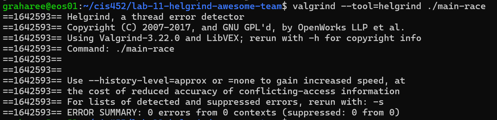
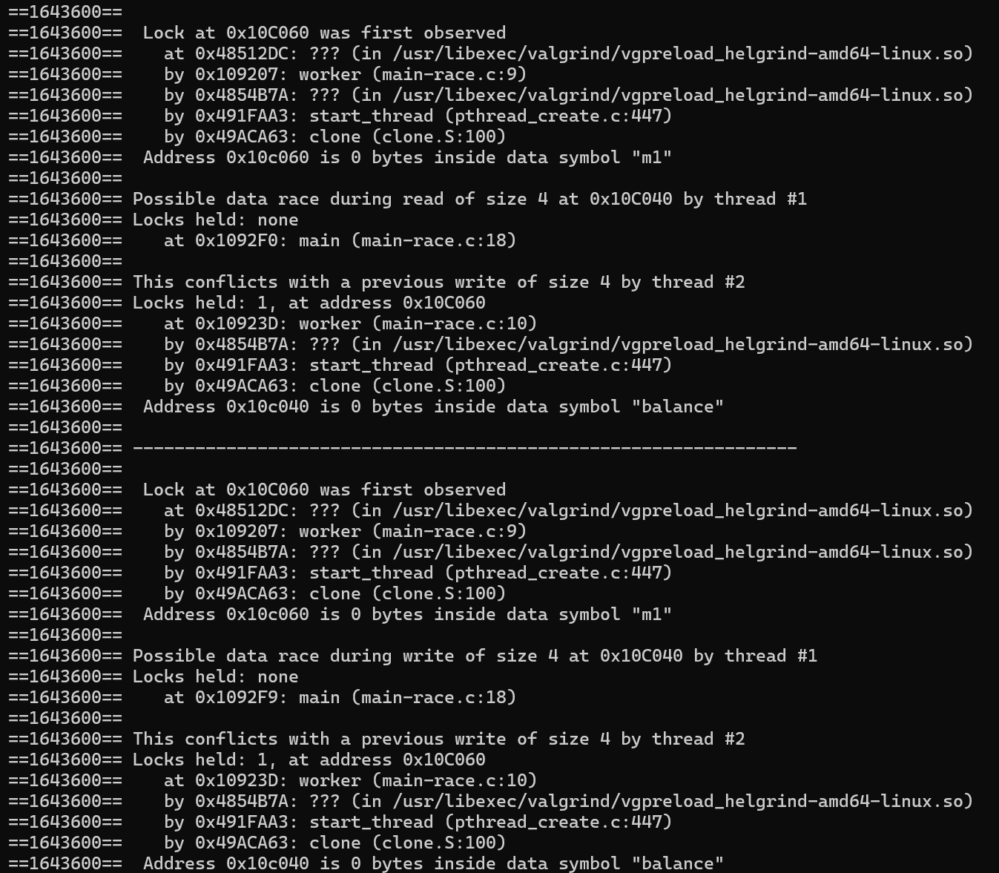
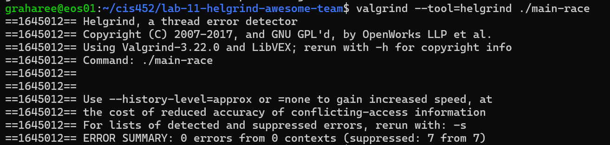
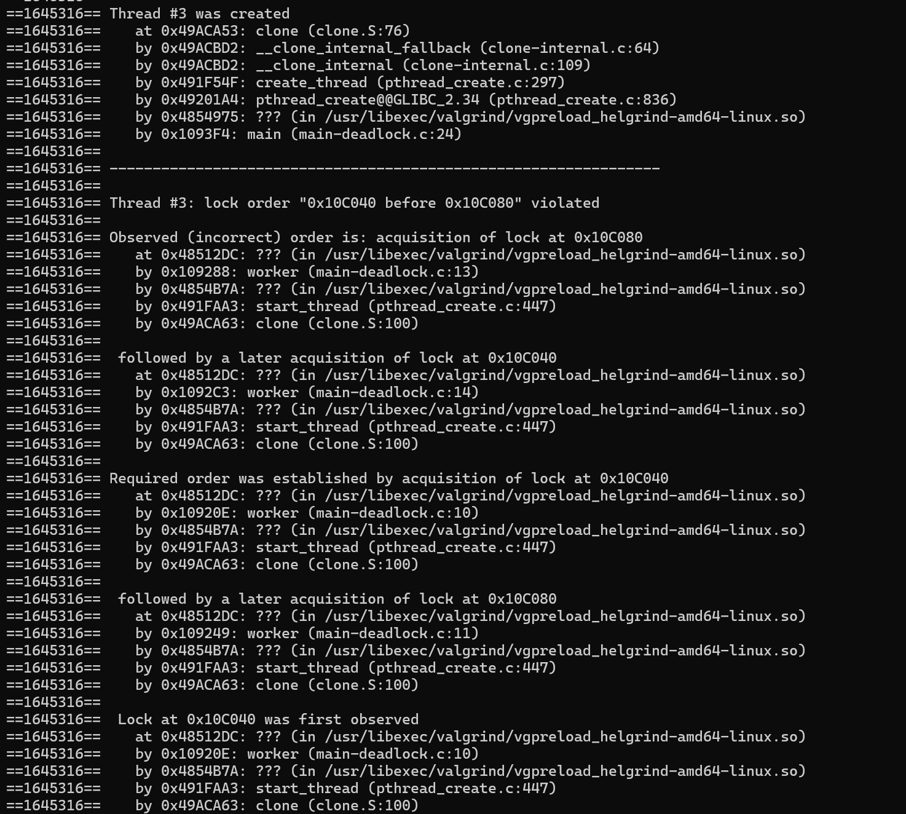

## Lab 11 -- Answers: Reegan Graham & Bilal Redzic
### Question 1
* Yes, the correct lines of code are pointed to. This can be seen in the Helgrind output at main `(main-race.c:15)` and `(main-race.c:8)`, which identify the lines in main-race.c involved in the race condition.

* The Helgrind output also provides additional information about which threads were created, where the possible data race occurred, the memory location and shared variable involved, and whether any locks were being held at the time.

### Question 2
Helgrind does not find any race conditions, as seen below:

### Question 3
Helgrind still reports a data race because the other place where `balance` is modified is still unprotected.

### Question 4
Helgrind does not find any race conditions, as seen below:

### Question 5
* A deadlock is when locks are formatted in a way that does not let either thread access resources, this causes both threads to stop execution.

* This causes a deadlock because one thread locks `m1` then waits for `m2` while another locks `m2` then waits for `m1`, so both threads are stuck waiting on each other.

### Question 6
Helgrind reports inaccurate accquistion of locks (deadlock), as seen below:

### Question 7

### Question 8

### Question 9

### Question 10

### Question 11

